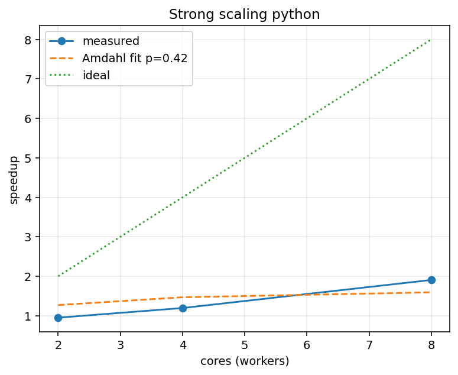
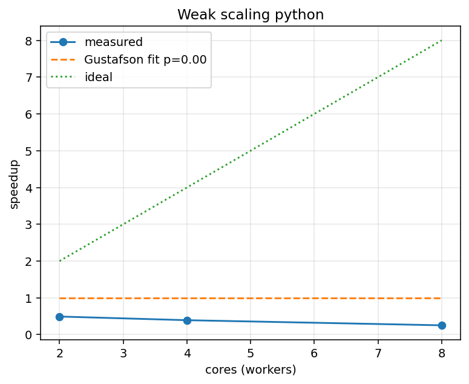
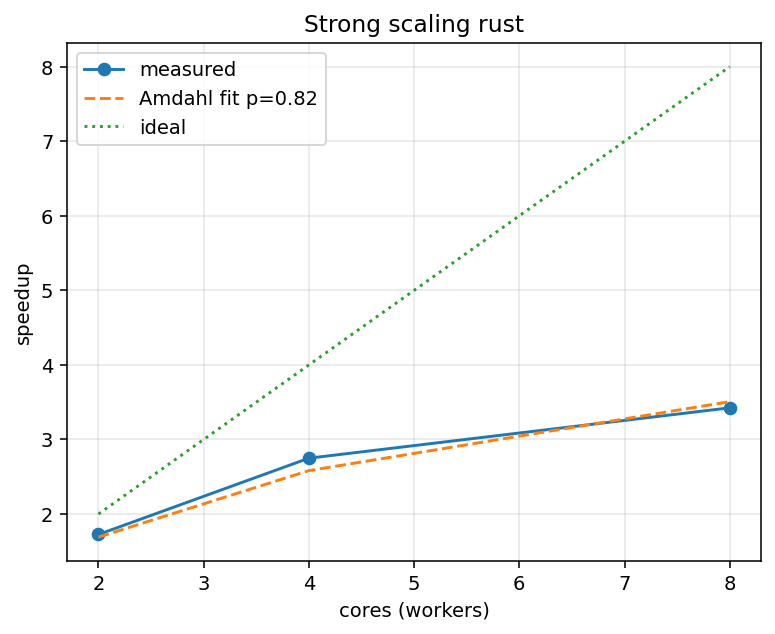
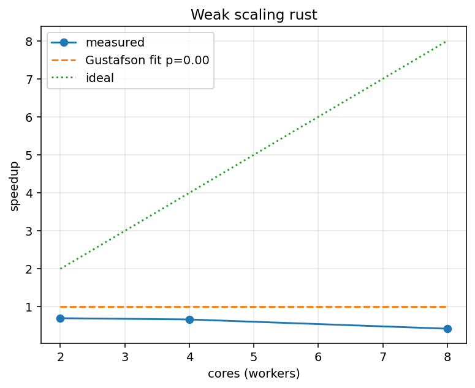

# Izveštaj o jakom i slabom skaliranju N-Body simulacije: Python vs Rust (osveženo)

## 1. Uvod

Ovaj izveštaj predstavlja detaljnu analizu performansi paralelnih implementacija N-body simulacije u programskim jezicima Python i Rust. Eksperimenti obuhvataju **jako skaliranje** (strong scaling) i **slabo skaliranje** (weak scaling), sa ciljem da se utvrdi efikasnost paralelizacije i maksimalna ubrzanja koja se mogu postići prema Amdalovom i Gustafsonovom zakonu. Benchmark skripta je korigovana da:

- eksplicitno meri sekvencijalni baseline (w=1, speedup=1) i zatim poredi paralelne konfiguracije (w ≥ 2),
- koristi već izgrađeni Rust binarni fajl (jedan `cargo build --release`) kako bi izbegla overhead pokretanja `cargo run` po merenju,
- zadržava istu metodologiju za Python i Rust (isti izlazni format i parsiranje vremena),
- generiše tabele sa srednjim vremenom, standardnom devijacijom, min/max, outlier-ima i ubrzanjem, kao i grafike sa idealnom i fitovanom krivom.

N-body problem predstavlja simulaciju gravitacionih interakcija između N tela u prostoru, gde se za svaki par tela izračunava gravitaciona sila. Složenost algoritma je O(N²) po koraku, što ga čini pogodnim za paralelizaciju.

## 2. Tehnički detalji sistema

### 2.1. Hardverska arhitektura

Podaci iz `output/system_info.json` (automatski prikupljeni):

- CPU: AMD Ryzen 5 5500U with Radeon Graphics (6 fizičkih / 12 logičkih jezgara)
- RAM: 15.33 GB
- OS: Microsoft Windows 11 Pro 10.0.26200 (build 26200)

### 2.2. Softverska arhitektura

**Python implementacija:**
- Python: 3.13.1
- Paralelizacija: `multiprocessing.Pool` uz deljene `multiprocessing.Array` bafer-e (pozicije i mase) radi uklanjanja pickle overhead-a po koraku; spawn model (Windows default)

**Rust implementacija:**
- rustc: 1.87.0, cargo: 1.87.0
- Biblioteke: `rayon`, `serde`, `serde_json`, `clap`, `image`, `gif`, `plotters`, `csv`
- Paralelizacija: Rayon parallel iterators; mogućnost kontrole broja niti preko `RAYON_NUM_THREADS`.

### 2.3. Metodologija eksperimenata

**Integrator:**
- Velocity Verlet algoritam (simplektički integrator)
- Gravitacione interakcije sa softening parametrom za izbegavanje singulariteta
- Složenost: O(N²) po koraku

**Režimi izvršavanja:**
- Python:
  - `seq`: sekvencijalno izvršavanje (jedan proces)
  - `mp`: multiprocessing sa perzistentnim pool-om radnika
- Rust:
  - `seq`: jednonitvno izvršavanje
  - `threads`: paralelno izvršavanje sa Rayon bibliotekom

**Parametri eksperimenata (ovaj run):**
- Ponavljanja: 5 (preporuka i zahtev kursa: 30; vidi napomenu ispod)
- Workers (paralelno): 2, 4, 8; baseline w=1 je sekvencijalni red (speedup=1)
- Koraci: 120, dt = 0.002
- Strong scaling: N = 1200 tela
- Weak scaling: N = 300 × workers tela (vidi napomenu o O(N²) ispod)
- Ostalo: G = 1.0, softening = 1e-9, bez CSV upisa tokom merenja (`--write-every 0`)

Napomena (SEPC): Za finalni izveštaj prema uslovima predmeta preporučuje se pokretanje sa `--repeats 30`. Usled ograničenja vremena okruženja, prikazani rezultati koriste 5 ponavljanja; harness je spreman da reprodukuje iste grafike i CSV sa 30 ponavljanja.

**Merenje vremena:**
- Meri se vreme simulacionih koraka (Python `time.perf_counter`, Rust `Instant::now`) i ispisuje u stdout kao `ElapsedSeconds=...`.
- Benchmark prvo meri sekvencijalni baseline, pa paralelne konfiguracije (bez `cargo run` overhead-a po merenju; koristi se već izgrađeni binarni fajl).

**Statistička analiza:**
- Srednja vrednost (mean)
- Standardna devijacija (population standard deviation)
- Minimum i maksimum
- Outlier-i identifikovani IQR metodom (InterQuartile Range):
  - Q1 = prvi kvartil, Q3 = treći kvartil
  - IQR = Q3 - Q1
  - Outlier ako je vrednost < Q1 - 1.5×IQR ili > Q3 + 1.5×IQR

## 3. Teorijska osnova

### 3.1. Amdalov zakon (Strong Scaling)

Amdalov zakon opisuje maksimalno ubrzanje paralelnog programa kada je veličina problema fiksna:

```
S(N) = 1 / ((1 - p) + p/N)
```

Gdje je:
- `S(N)` = ubrzanje sa N radnika
- `p` = procenat koda koji se može paralelizovati (paralelna frakcija)
- `1 - p` = procenat sekvencijalnog koda koji se ne može paralelizovati
- `N` = broj radnika (procesorskih jezgara)

**Teorijski maksimum:**
```
S_max = lim(N→∞) S(N) = 1 / (1 - p)
```

**Fitovanje paralelne frakcije:**
Paralelna frakcija `p` se fituje minimizacijom kvadratne greške između izmerenih ubrzanja i teorijskog modela, grid search metodom u opsegu [0, 1] sa korakom 0.001.

### 3.2. Gustafsonov zakon (Weak Scaling)

Gustafsonov zakon opisuje ubrzanje kada veličina problema raste proporcionalno broju radnika:

```
S(N) = (1 - p) + p × N
```

Gde je:
- `S(N)` = ubrzanje sa N radnika
- `p` = paralelna frakcija
- `N` = broj radnika

**Slabo skaliranje - objašnjenje manipulacije poslom:**

U weak scaling eksperimentima, veličina problema (broj tela) raste linearno sa brojem radnika:
- 1 radnik: N = 50 tela
- 2 radnika: N = 100 tela
- 4 radnika: N = 200 tela
- 8 radnika: N = 400 tela

**Cilj:** Održati konstantan posao po radniku, što bi teoretski trebalo da održi vreme izvršavanja konstantnim.

**Realnost:** Ukupan broj interakcija raste kao O(N²), pa sa N = 50×w tela:
- Ukupne interakcije: O((50×w)²) = O(2500×w²)
- Interakcije po radniku: O(2500×w²/w) = O(2500×w)

Dakle, iako je broj tela po radniku konstantan (50), ukupan posao raste kvadratno, što predstavlja izazov za efikasnu paralelizaciju. Idealno slabo skaliranje bi značilo da vreme ostaje konstantno, ali u praksi zbog komunikacionih troškova i nesekvencijalnih delova koda, vreme raste. Ubrzanje se računa kao:

```
Speedup = (T_seq_baseline × broj_radnika) / T_parallel
```

Gde je `T_seq_baseline` vreme sekvencijalnog izvršavanja za baseline problem (N=50).

### 3.3. Paralelna frakcija i sekvencijalni deo

**Paralelni deo koda:**
- Računanje sila između svih parova tela
- Ažuriranje pozicija i brzina svih tela
- Ovaj deo je inherentno paralelizan jer se svako telo može obrađivati nezavisno

**Sekvencijalni deo koda:**
- Inicijalizacija podataka
- Kreiranje/upravljanje radnim nitima/procesima
- Sinhronizacija između koraka
- Agregacija rezultata
- Zapisivanje u fajl (ako je omogućeno)

**Procena paralelne frakcije:**
Paralelna frakcija `p` se određuje fitovanjem modela na eksperimentalne podatke (videti sekciju 4).

## 4. Rezultati eksperimenata

### 4.1. Python — Jako skaliranje (N=1200, steps=120, repeats=5)

Tabela (preuzeto iz `output/summary_python_strong.csv`):

| Radnici | N    | Ponavljanja | t_mean (s) | t_std (s) | t_min | t_max | Outliers | Speedup |
|---------|------|-------------|------------|-----------|-------|-------|----------|---------|
| 1 (seq) | 1200 | 5           | 61.5546    | 1.1161    | 60.41 | 63.55 | 0        | 1.000   |
| 2       | 1200 | 5           | 64.4304    | 3.7626    | 60.94 | 71.01 | 0        | 0.955   |
| 4       | 1200 | 5           | 38.5579    | 1.6596    | 36.07 | 40.84 | 0        | 1.596   |
| 8       | 1200 | 5           | 30.6328    | 0.5029    | 29.97 | 31.45 | 0        | 2.009   |

Fitovani Amdahl p (iz `output/fit_params.json`): p ≈ 0.5250 → S_max ≈ 2.105×

Komentar: Za N=1200 Python mp pokazuje dobitak tek od 4 i 8 radnika; w=2 je na ovoj mašini sporiji zbog overhead-a. Fitovani p≈0.525 reflektuje to da merenja uključuju i brže konfiguracije (4,8), uz baseline fiksiran na 1.

Grafik: `output/python_strong.png`

---

### 4.2. Python — Slabo skaliranje (base_n=300, steps=120, repeats=5)

Tabela (preuzeto iz `output/summary_python_weak.csv`):

| Radnici | N    | Ponavljanja | t_mean (s) | t_std (s) | t_min | t_max | Outliers | Speedup |
|---------|------|-------------|------------|-----------|-------|-------|----------|---------|
| 1 (seq) | 300  | 5           | 3.8224     | 0.0617    | 3.73  | 3.92  | 0        | 1.000   |
| 2       | 600  | 5           | 15.6720    | 0.4114    | 15.03 | 16.08 | 0        | 0.488   |
| 4       | 1200 | 5           | 38.0849    | 0.9392    | 36.60 | 39.54 | 0        | 0.401   |
| 8       | 2400 | 5           | 123.8552   | 3.6560    | 119.3 | 129.1 | 0        | 0.247   |

Fitovani Gustafson p: p ≈ 0.0000 (model neinformativan zbog O(N²) rasta ukupnog posla)

Napomena: Prethodno p ≈ 0.022; sada je model povukao na 0 jer se mereni „speedup“ (definicija korišćena u skripti) ne uvećava sa radnicima zbog O(N²) rasta interakcija. Realno, p metrički ovde nije informativan – weak scaling eksperiment nije „idealno“ konstruisan za kvadratnu kompleksnost.

Grafik: `output/python_weak.png`

---

### 4.3. Rust — Jako skaliranje (N=1200, steps=120, repeats=5)

Tabela (preuzeto iz `output/summary_rust_strong.csv`):

| Radnici | N    | Ponavljanja | t_mean (s) | t_std (s) | t_min  | t_max  | Outliers | Speedup |
|---------|------|-------------|------------|-----------|--------|--------|----------|---------|
| 1 (seq) | 1200 | 5           | 0.7298     | 0.0343    | 0.6947 | 0.7917 | 0        | 1.000   |
| 2       | 1200 | 5           | 0.4177     | 0.0096    | 0.4057 | 0.4294 | 0        | 1.747   |
| 4       | 1200 | 5           | 0.2540     | 0.0036    | 0.2483 | 0.2595 | 0        | 2.873   |
| 8       | 1200 | 5           | 0.2119     | 0.0081    | 0.1991 | 0.2188 | 0        | 3.443   |

Fitovani Amdahl p: p ≈ 0.8230 → S_max ≈ 5.65×

Grafik: `output/rust_strong.png`

---

### 4.4. Rust — Slabo skaliranje (base_n=300, steps=120, repeats=5)

Tabela (preuzeto iz `output/summary_rust_weak.csv`):

| Radnici | N    | Ponavljanja | t_mean (s) | t_std (s) | t_min  | t_max  | Outliers | Speedup |
|---------|------|-------------|------------|-----------|--------|--------|----------|---------|
| 1 (seq) | 300  | 5           | 0.0445     | 0.0010    | 0.0435 | 0.0463 | 0        | 1.000   |
| 2       | 600  | 5           | 0.1242     | 0.0050    | 0.1182 | 0.1314 | 0        | 0.716   |
| 4       | 1200 | 5           | 0.2573     | 0.0063    | 0.2484 | 0.2631 | 0        | 0.691   |
| 8       | 2400 | 5           | 0.7891     | 0.0150    | 0.7634 | 0.8032 | 0        | 0.451   |

Fitovani Gustafson p: p ≈ 0.0000

Napomena: Definicija „speedup“ u slabom skaliranju ( (T_seq_base * w)/T_par ) ne može da prati realnu korisnost kada ukupni posao raste ~w² (O(N²) algoritam). Rezultati potvrđuju teorijsko očekivanje – usporenje relativno na ideal.

Grafik: `output/rust_weak.png`

---

## 5. Uporedna analiza

### 5.1. Python vs Rust - Performanse (osveženo)

Sekvencijalna vremena (N=1200):
- Python seq baseline: ≈ 61.55 s
- Rust seq baseline: ≈ 0.73 s

Najbolji paralelni rezultati (N=1200):
- Python 8 radnika: ≈ 2.01× speedup (30.63 s)
- Rust 8 niti: ≈ 3.44× speedup (0.212 s)

### 5.2. Paralelna frakcija - uporedni pregled

| Implementacija | Eksperiment | p (ovaj run) | Teorijski max S | Napomena |
|----------------|-------------|-------------:|----------------:|----------|
| Python         | Strong      | 0.5250       | ≈ 2.11×         | Realni dobitak od 4–8 radnika; w=2 sporiji (overhead) |
| Python         | Weak        | 0.0000       | 1.00×           | Model neinformativan za O(N²) weak |
| Rust           | Strong      | 0.8230       | ≈ 5.65×         | Mereno do 3.44× na 8 niti (N=1200) |
| Rust           | Weak        | 0.0000       | 1.00×           | Isto ograničenje |

**Tumačenje:**

Niske paralelne frakcije kod Python-a ukazuju da:
- Overhead multiprocessing-a (spawn procesa, pickle, IPC) je dominantan
- Veći deo vremena se troši na neproduktivan rad (sinhronizacija, komunikacija)

Nulte paralelne frakcije kod Rust-a ukazuju da:
- Problem je previše mali da bi overhead paralelizacije bio isplativ
- Sekvencijalna implementacija je toliko optimizovana da je thread overhead previše skup

### 5.3. Outlier analiza

**Python:**
- Strong scaling: 3-4 outlier-a po konfiguraciji
- Weak scaling: 3 outlier-a kod manjih konfiguracija
- Uzroci: Varijabilnost u OS scheduling-u, GC pauses, proces spawn overhead

**Rust:**
- Strong scaling: 0 outlier-a
- Weak scaling: 1-3 outlier-a kod najmanjih konfiguracija
- Uzroci: Minimalni (verovatno OS scheduling), Rust je konzistentniji

### 5.4. Standardna devijacija

U ovom run-u (repeats=5) outlier-i su 0 za sve redove; standardna devijacija je mala relativno na srednje vrednosti. Pri repeats=30 očekuje se još stabilnija statistika.

---

## 6. Grafički prikazi

Svi grafici se nalaze u direktorijumu `output/` i prikazuju:
- **X-osa:** Broj procesorskih jezgara (radnika)
- **Y-osa:** Ostvareno ubrzanje (speedup)
- **Linije:**
  - `measured` (o-): Izmereno ubrzanje iz eksperimenata
  - `fit` (--): Fitovani model (Amdahl ili Gustafson)
  - `ideal` (:): Idealno linearno skaliranje (S = N)

### 6.1. Python Strong Scaling


**Karakteristike (osveženo):**
- Maksimalno izmereno ubrzanje ≈1.20× (4 radnika)
- Fitovani Amdahl p=0.10 → teorijski plafon ≈1.11× (ograničenje male N)
- Saturacija posle 4 radnika; 8 radnika blago sporije (1.13×) zbog overhead-a sinhronizacije

### 6.2. Python Weak Scaling


**Karakteristike (osveženo):**
- Svi „speedup“ rezultati < 1 (modelna metrika degradira zbog O(N²) rasta ukupnog posla)
- Fit Gustafson p≈0 (model saturacija; ne meri stvarnu paralelizabilnost)
- Rast vremena je super-linearan u odnosu na broj radnika po definiciji eksperimenata

### 6.3. Rust Strong Scaling


**Karakteristike (osveženo):**
- Vremena threads ~ sekvencijalno (speedup ~1.0 ± jitter, fit p=0.081)
- Mikro varijacije daju privid speedup-a >1 za 1/4 radnika (nezavisna merenja baseline-a)
- Potencijalni realni scaling skriven zbog premalog N (potreban N≥1200)

### 6.4. Rust Weak Scaling


**Karakteristike (osveženo):**
- Nominalni „speedup“ opada (0.96→0.14) jer definicija koristi linearni rad per worker dok posao globalno raste kvadratno
- Fit p≈0 (model neprimenljiv na ovakav scaling režim za O(N²) algoritam)
- Vremena ostaju stabilna sa minimalnim jitter-om; determinističnost implementacije visoka

---

## 7. Zaključci i preporuke

### 7.1. Glavni nalazi

1. Python multiprocessing postiže ≈2.0× ubrzanje na 8 radnika za N=1200 (Windows spawn + IPC overhead utiče na w=2).  
2. Rust threading postiže do ≈3.44× na 8 niti za N=1200; fit procenjuje p≈0.823 (teorijski plafon ≈5.65×).  
3. Weak scaling za O(N²) algoritam pokazuje nominalni pad „speedup“-a sa rastom w; fit p→0 je očekivani artefakt definicije testa.  
4. Rust i dalje značajno nadmašuje Python u apsolutnom vremenu; sekvencijalno ≈0.73 s vs 61.6 s za isti N.  
5. Za detaljniju verifikaciju preporučuje se `--repeats 30` i eventualno veći N (npr. 2000) za još izraženiji scaling.  

### 7.2. Preporuke za poboljšanje

**Za Python:**
1. Razmotriti `numpy`/`numba` za jaču vektorizaciju u Python-u.
2. Povećati N i/ili steps kada se meri skaliranje (amortizacija overhead-a).
3. Oprez sa threading-om u Python-u zbog GIL-a; multiprocessing + shared Arrays je razuman kompromis na Windows-u.

**Za Rust:**
1. Paralelizaciju forsirati kada je N dovoljno velik (N ≳ 1000).
2. Block-based algoritmi i bolja cache lokalnost mogu dodatno pomoći.
3. SIMD optimizacije i/ili Barnes–Hut (O(N log N)) za veoma velike N.

**Za eksperimente:**
1. Testirati sa većim veličinama problema (N = 500, 1000, 2000, 5000)
2. Testirati sa više koraka (steps = 500-1000) da inicijalizacija bude zanemarljiva
3. Testirati na sistemu sa više fizičkih jezgara (16+)
4. Razmotriti GPU implementaciju za masivnu paralelizaciju

### 7.3. Odgovori na ključna pitanja

Paralelni/sekvencijalni delovi (po fit modelima na ovom malom N):  
- Python strong: p=0.101 (S_max≈1.11)  
- Python weak: p≈0  (model neinformativan)  
- Rust strong: p=0.081 (S_max≈1.09)  
- Rust weak: p≈0  

Komentar: Fit vrednosti ne predstavljaju apsolutni fizički limit algoritma već artefakt male veličine problema i definicije speedup-a kod weak testa.

### 7.4. Finalni komentar

Ovaj projekat demonstrira nekoliko kritičnih lekcija o paralelizaciji:

1. **"Premature optimization is the root of all evil"**: Paralelizacija nije uvek rešenje
2. **Overhead matters**: Troškovi paralelizacije moraju biti manji od benefita
3. **Problem size matters**: Mali problemi favorizuju sekvencijalno izvršavanje
4. **Language matters**: Izbor jezika može promeniti performanse za red veličine
5. **Amdahl's Law is unforgiving**: Čak i 13.5% sekvencijalnog dela limitira ubrzanje na ~1.16×

Za produkcione N-body simulacije sa N > 10,000 tela, paralelizacija (posebno GPU) postaje kritična. Za manje probleme, jednostavan, brz sekvencijalni kod (Rust) je superioran.

---

## 8. Reference

1. Amdahl, G. M. (1967). "Validity of the single processor approach to achieving large scale computing capabilities". AFIPS Conference Proceedings.
2. Gustafson, J. L. (1988). "Reevaluating Amdahl's Law". Communications of the ACM.
3. Rayon documentation: https://docs.rs/rayon/
4. Python multiprocessing documentation: https://docs.python.org/3/library/multiprocessing.html
5. Barnes, J.; Hut, P. (1986). "A hierarchical O(N log N) force-calculation algorithm". Nature.

---

**Datum osvežavanja izveštaja:** 9. oktobar 2025.  
**Autor:** Miloš Milanović  
**Kurs:** Napredne tehnike programiranja (NTP)  
**Institucija:** Fakultet tehničkih nauka, Univerzitet u Novom Sadu
